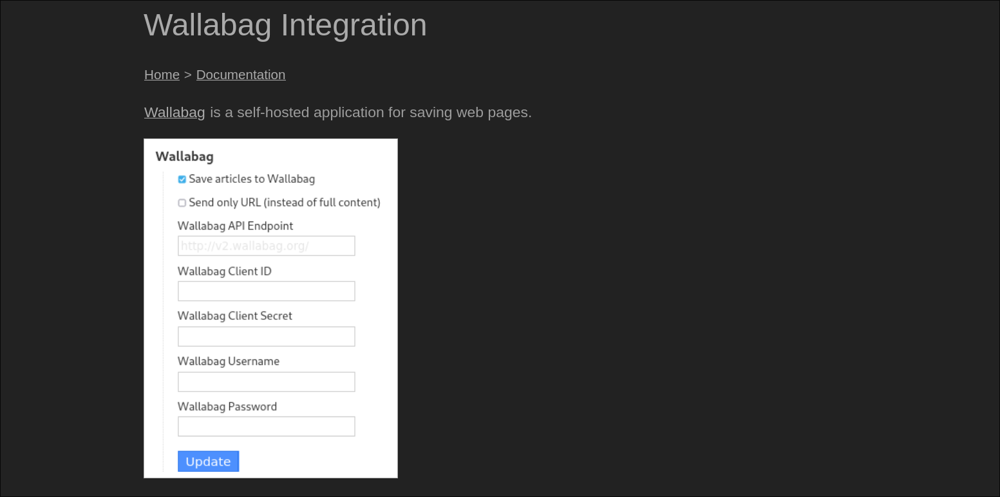
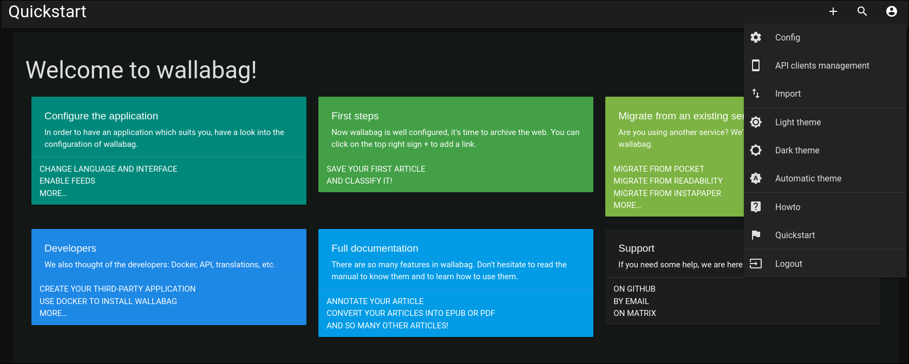
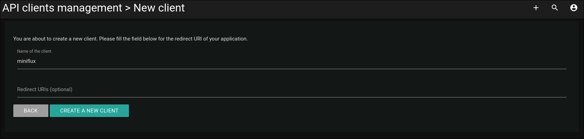
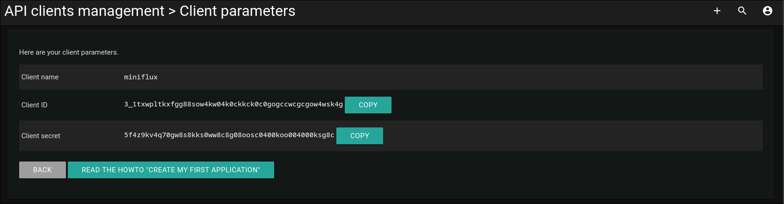
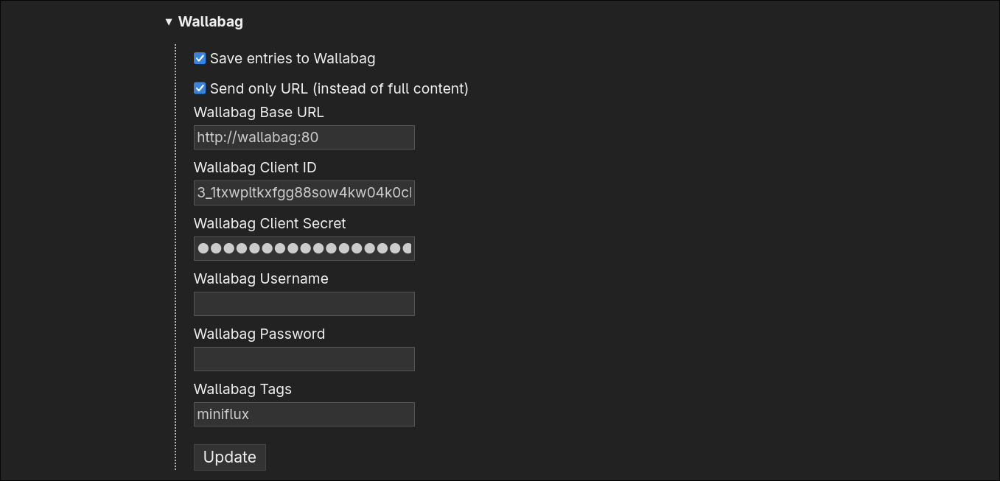

# miniflux

## Description

Miniflux is an opinionated RSS reader.
It is very lighweight as it focuces on simplicity and functionality.

As written in the main page:
_Miniflux is a minimalist software. **The purpose of this application is
to read feeds**. Nothing else._

## Environmental variables

### Changing default variables

As most of my services in my homelab I have created a `.env` file
to store configuration settings.

I have deciced to change the default values for the following variables:

- **ADMIN_PASSWORD**
- **POSTGRESS_PASSWORD**

> [!NOTE]
> When changing the value for `POSTGRESS_PASSWORD` the variable `DATABASE_URL`
> must also be changed accordingly.
> The `DATABASE_URL` has the form:
> DATABASE_URL=postgres://<POSTGRESS_USER>:<POSTGRESS_PASSWORD>@db/miniflux?sslmode=disable
> So, replace POSTGRESS_PASSWORD with the one in the .env file.
> Also, do not change the value of `POSTGRESS_USER`
> as the default user name is needed.

> [!NOTE]
> When trying out different settings you might need to delete the
> directory or volume where miniflux writes its data.
> For example if you build miniflux once and change the `ADMIN_PASSWORD`
> (without removing the created volume) and then rebuild miniflux
> you will not be able to login as admin.
> This is because the old password is still saved in the volume.
> To solve this simply remove the volume across rebuilds
> if you have changed any of the environmental variables.

### Notes on global variables

The [documentation](https://miniflux.app/docs/configuration.html)
mentions that miniflux uses either environmental variable or a config file.
If miniflux is running in docker the configuration variables should
be defined in the `.env` file as stated in [issue 3115](https://github.com/miniflux/v2/issues/3115).

## Wallabag integration

Miniflux has an [integration](https://miniflux.app/docs/wallabag.html)
were you can send an entry to wallabag to read it later.

Click on the user icon>API clients management

Create an api key from you user
This can also be created from the wallabag (admin) user,
but it is better to do it from your user (for permission reasons).

Copy the client id and client secret, then
enter the username and password of the user in the integration form
(the username and password of the user for which the entry should be saved)

### Reverse proxy

If you are using a reverse proxy you should use the name
of the proxied domain as **Wallabag API Endpoint** instead
of what it is being proxied as.

For example if both wallabag and miniflux are running as containers
and they are on the same docker network you should use
**http://wallabag:80** as the API endpoint
instead of **https://wallabag.mydomain.com**
(or whatever you have inserted in the reverse proxy config).

---

Sources

1. [Installation with docker](https://miniflux.app/docs/docker.html)
2. [Miniflux wallabag integration](https://miniflux.app/docs/wallabag.html)
