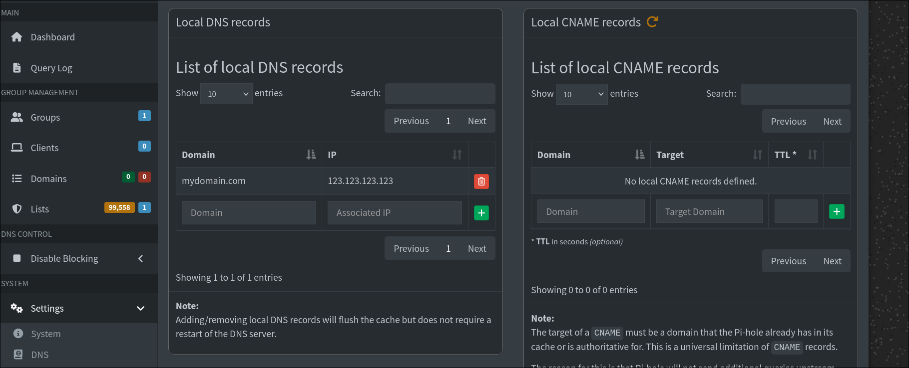

# Pihole

## Description

Pihole is a program that acts as a DNS sinkhole
and optionally as a DHCP server.

## Local DNS

Go to `Settings>DNS>Local DNS records`
and enter a record like the one in the .

### Wildcard records

If you have a domain like mydomain.com you might find it helpful
to create a wildcard record that resolves all subdomains.
Pihole does not have a builtin method to do that
so we are going to utilise dnsmasq (which pihole uses under the hood).

To do that we are going to add an entry to `/etc/dnsmasq.d`.

> [!NOTE]
> This is the path inside pihole.
> If you are running pihole as a container you
> will have to bind the directory above to one in you machine

Firstly,go to `Settings>All Settings>Miscellaneous` and enable
[misc.etc_dnsmasq_d](./images/mischellaneous_setting.png).

Then add a file with the name `90-mydomain.com.conf`
(the final path will be`/etc/dnsmasq.d/90-mydomain.com.conf`).

> [!NOTE]
> The configuration is applied based on the order the
> configuration files were sourced.
> By using numbers as prefixes you can set each configuration file's priority
> (The smaller the number the higher the priority).

Inside the file paste the following:

```bash
address=/mydomain.com/123.123.123.123
```

By entering this pihole will resolve `mydomain.com` as well
as `*.mydomain.com` to `123.123.123.123`.

There are blog threads that say to use a `.`
before the domain name for wild card dns (address=/.mydomain.com/123.123.123.123).
This is incorrect and will not work.

For more information check
the `--address` and `--servers` flags in
the [dnsmasq man page](https://linux.die.net/man/8/dnsmasq)
as well as the [debian dnsmasq man page](https://manpages.debian.org/jessie/dnsmasq-base/dnsmasq.8.en.html)

Take note that the man page refers to how to use the command
`dnsmasq` instead of creating a configuration file.
Normally when using dnsmasq you would enter a command
in your terminal like:

```bash
dnsmasq --address=...
```

Since we are using dnsmasq through pihole
and creating a configuration file only the `address=...` part is necessary.

#### Override a specific domain

You can also override this to specify an address only for a
subdomain (ex `subdomain1`).
To do that your configuration file must look like:

```bash
address=/subdomain1.mydomain.com/124.124.124.124
address=/mydomain.com/123.123.123.123
```

`subdomain1.mydomain.com` will now resolve to
`124.124.124.124`, while all the other subdomains
will resolve to `123.123.123.123`.

#### Only resolve wildcard domains

To only resolve subdomains you configuration
file must look like:

```bash
address=/*.mydomain.com/123.123.123.123
```

This will resolve `*.mydomain.com` to `123.123.123.123`
but will not resolve `mydomain.com`.

## Problem with mobile devices

If you have set pihole as your DNS server from your router
settings you might encounter problems with mobile devices.
This happens for security reasons around private DNS.
For normal DNS records there will be no problem
since pihole does not actually resolve domains
but makes a request to an upstream DNS server.
However, this does not apply to local DNS records and they
might not work on mobile devices.

To solve this you can add a DNS record to your domain registrar.

---

Sources:

1. [dnsmasq man page](linux.die.net/man/8/dnsmasq)
2. [debian dnsmasq man page](https://manpages.debian.org/jessie/dnsmasq-base/dnsmasq.8.en.html)
3. [How to configure Pi-hole for local DNS resolution in your LAN](https://aalonso.dev/blog/2026/how-to-configure-pihole-for-local-dns-resolution-in-your-lan/)
