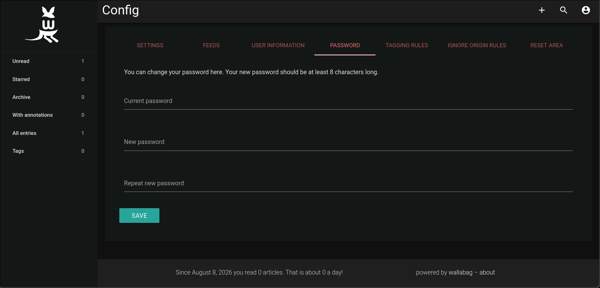

# Wallabag

## Descrition

Wallabag is a read-it-later app designed for people who want ownership,
not another closed inbox.

## Configuration

Most of the environmental variables set in the original
[docker-compose.yml](https://github.com/wallabag/docker)
cannot be changed so you are stuck with the default
admin and db password.

However, when you log into the wallabag user you can change
their password through the web ui.

To do that go to My Account>Config>PASSWORD,
enter the current password of the `wallabag` user
(the one defined in the environmental variable)
and then the new password.

### Reverse proxy

You should set `SYMFONY__ENV__DOMAIN_NAME`
to have the value of the domain that is proxied

For example if you are going to host wallabag on
`wallabag.mydomain.com` you should set
`SYMFONY__ENV__DOMAIN_NAME=https://wallabag.mydomain.com`.

---

Sources:

1. [Wallabag docker docs](https://github.com/wallabag/docker)
2. [Wallabag docs](https://doc.wallabag.org/admin/installation/installation/#installation-with-docker-or-docker-compose)
